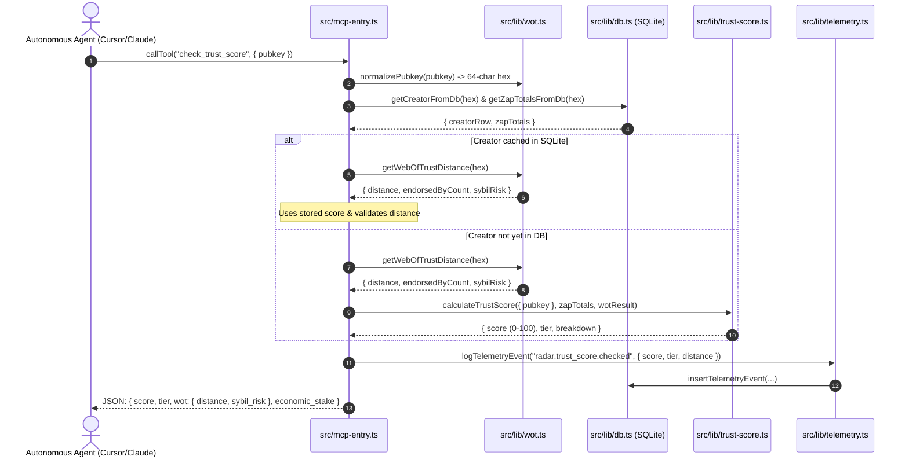
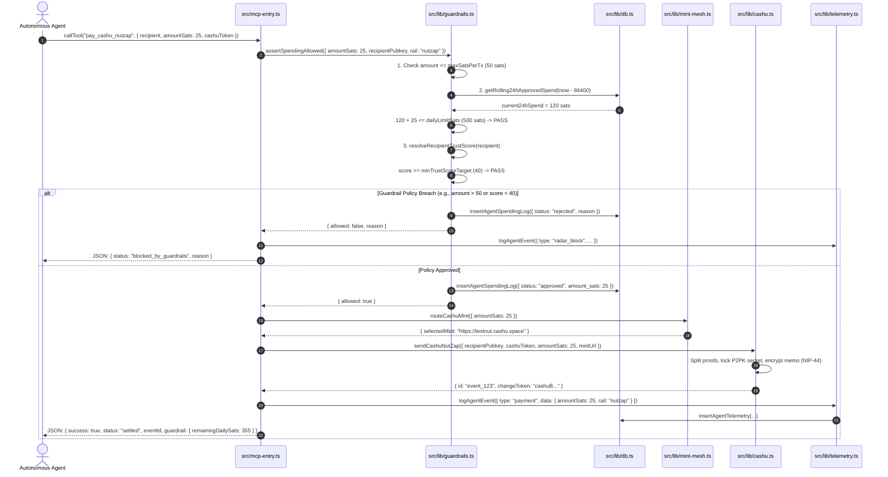
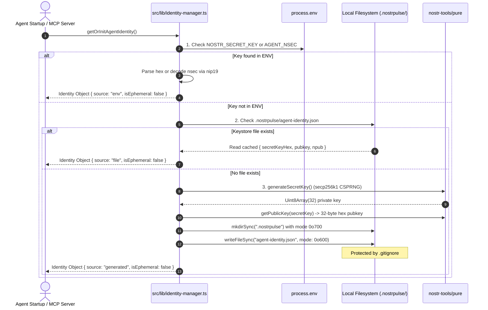

# NostrPulse System Blueprint & Technical Architecture

> **Document Status:** Active / Production Reference  
> **Maintainer:** NostrPulse Core Team  
> **Repository:** `nostrpulse-full`  
> **Last Updated:** September 2026  

---

## Executive Overview

**NostrPulse** is a decentralized Anti-Sybil Trust Layer, Autonomous eCash/Lightning Settlement Engine, and Model Context Protocol (MCP) server for autonomous AI agents. It bridges sovereign decentralized protocols (**Nostr**, **Cashu eCash**, **Lightning Network**) with frontier agent runtimes (**Claude Desktop**, **Cursor**, **Vercel AI SDK**, **LangChain**).

This document serves as the single source of truth for the codebase architecture, file registry, data flow lifecycles, and test catalog.

---

## 1. File Registry (`src/lib/` & `src/mcp-entry.ts`)

| File Path | Core Role (One-Sentence Summary) | Relevant Protocols | Primary Module Dependencies |
| :--- | :--- | :--- | :--- |
| [`src/mcp-entry.ts`](file:///D:/UIT/NamBonUIT/nostrpulse-full/src/mcp-entry.ts) | Main MCP server entry point exposing 10 stdio JSON-RPC tools to AI agent runtimes. | MCP, JSON-RPC | `wot`, `trust-score`, `guardrails`, `cashu`, `nwc`, `mint-mesh`, `identity-manager`, `telemetry`, `db` |
| [`src/lib/identity-manager.ts`](file:///D:/UIT/NamBonUIT/nostrpulse-full/src/lib/identity-manager.ts) | Sovereign cryptographic identity manager providing zero-config bootstrapping, keystore persistence, and key derivation. | NIP-01, NIP-19 | `nostr-tools/pure`, `nostr-tools/nip19`, `fs`, `path` |
| [`src/lib/guardrails.ts`](file:///D:/UIT/NamBonUIT/nostrpulse-full/src/lib/guardrails.ts) | Real-time financial gatekeeper enforcing per-transaction caps, 24h rolling allowances, and counterparty WoT trust gates. | Anti-Sybil Policy | `db`, `wot`, `trust-score` |
| [`src/lib/spending-guardrails.ts`](file:///D:/UIT/NamBonUIT/nostrpulse-full/src/lib/spending-guardrails.ts) | Budget allocation tracker and daily satoshi quota auditor for autonomous agent workflows. | Internal Policy | `db` |
| [`src/lib/telemetry.ts`](file:///D:/UIT/NamBonUIT/nostrpulse-full/src/lib/telemetry.ts) | Stripe Radar-style developer observability engine recording payments, intercepted threats, and audit trails. | Internal Audit | `db`, `identity-manager` |
| [`src/lib/wot.ts`](file:///D:/UIT/NamBonUIT/nostrpulse-full/src/lib/wot.ts) | Web-of-Trust (WoT) graph traversal engine executing BFS distance scoring from Genesis anchor nodes. | NIP-01, NIP-02 | `anchors.ts`, `ring1-cache.json` |
| [`src/lib/trust-score.ts`](file:///D:/UIT/NamBonUIT/nostrpulse-full/src/lib/trust-score.ts) | Multi-pillar reputation engine synthesizing WoT distance, verified zap stake, account age, and relay diversity. | NostrPulse 5-Pillar | `wot`, `db`, `nip05` |
| [`src/lib/cashu.ts`](file:///D:/UIT/NamBonUIT/nostrpulse-full/src/lib/cashu.ts) | eCash processor handling NIP-61 NutZaps, P2PK token locking, NIP-44 encrypted memos, and mint quotes. | NIP-61, NUT-00..06, NIP-44 | `@cashu/cashu-ts`, `nostr-tools`, `db` |
| [`src/lib/mint-mesh.ts`](file:///D:/UIT/NamBonUIT/nostrpulse-full/src/lib/mint-mesh.ts) | Dynamic Mint Mesh engine auditing NUT-06 endpoints and routing payments to highest-trust, lowest-latency mints. | NUT-06, NIP-05 | `wot`, `cashu` |
| [`src/lib/nwc.ts`](file:///D:/UIT/NamBonUIT/nostrpulse-full/src/lib/nwc.ts) | Direct Lightning Network settlement client communicating with self-custodied nodes via Nostr Wallet Connect. | NIP-47 | `nostr-tools`, `encryption` |
| [`src/lib/dvm.ts`](file:///D:/UIT/NamBonUIT/nostrpulse-full/src/lib/dvm.ts) | Distributed NIP-90 Data Vending Machine client dispatching analytics jobs across Nostr relays with local DB fallback. | NIP-90 (Kind 5000/5300) | `nostr`, `db` |
| [`src/lib/nip90.ts`](file:///D:/UIT/NamBonUIT/nostrpulse-full/src/lib/nip90.ts) | Data Vending Machine protocol constants, tag parsing, and request/result envelope builders. | NIP-90 | `nostr-tools` |
| [`src/lib/indexer.ts`](file:///D:/UIT/NamBonUIT/nostrpulse-full/src/lib/indexer.ts) | High-throughput event parser decoding BOLT-11 invoices, validating Schnorr signatures, and filtering fake zaps. | NIP-57, BOLT-11 | `nostr-tools`, `db` |
| [`src/lib/nostr.ts`](file:///D:/UIT/NamBonUIT/nostrpulse-full/src/lib/nostr.ts) | WebSocket connection pool and subscription manager interfacing with decentralized Nostr relays. | NIP-01, WebSocket | `nostr-tools/pool` |
| [`src/lib/db.ts`](file:///D:/UIT/NamBonUIT/nostrpulse-full/src/lib/db.ts) | Primary persistence layer providing SQLite / LibSQL connection pooling, migrations, and indexed queries. | SQL (SQLite/LibSQL) | `@libsql/client` |
| [`src/lib/tool-registry.ts`](file:///D:/UIT/NamBonUIT/nostrpulse-full/src/lib/tool-registry.ts) | Tool registry and dynamic JSON-Schema-to-Zod converter binding DVM capabilities to MCP servers. | MCP, NIP-89 | `@modelcontextprotocol/sdk`, `zod` |
| [`src/lib/base-executor.ts`](file:///D:/UIT/NamBonUIT/nostrpulse-full/src/lib/base-executor.ts) | Task execution harness with state transitions, timeout guarantees, and structured error boundaries. | Agent Task Framework | `telemetry` |
| [`src/lib/discovery.ts`](file:///D:/UIT/NamBonUIT/nostrpulse-full/src/lib/discovery.ts) | Discovery engine querying Kind 31990 NIP-89 announcements to identify active DVM computation providers. | NIP-89 | `nostr` |
| [`src/lib/economic-stake.ts`](file:///D:/UIT/NamBonUIT/nostrpulse-full/src/lib/economic-stake.ts) | Verifiable economic stake evaluator measuring verified Lightning zaps and sender graph legitimacy. | NIP-57 | `db`, `wot` |
| [`src/lib/encryption.ts`](file:///D:/UIT/NamBonUIT/nostrpulse-full/src/lib/encryption.ts) | Cryptographic module providing NIP-44 v2 payload encryption and NIP-59 sealed gossip envelopes. | NIP-44, NIP-59 | `nostr-tools/nip44` |
| [`src/lib/anchors.ts`](file:///D:/UIT/NamBonUIT/nostrpulse-full/src/lib/anchors.ts) | Curated seed public keys of Nostr pioneers (Genesis Anchors) used as ground truth for BFS graph exploration. | WoT Ground Truth | None |
| [`src/lib/creators.ts`](file:///D:/UIT/NamBonUIT/nostrpulse-full/src/lib/creators.ts) | Creator directory queries, metadata caching, and top-ranked builder retrieval. | NIP-01 | `db` |
| [`src/lib/nip05.ts`](file:///D:/UIT/NamBonUIT/nostrpulse-full/src/lib/nip05.ts) | Sovereign internet domain identifier validator querying `/.well-known/nostr.json` endpoints. | NIP-05 | None (Native fetch) |
| [`src/lib/search.ts`](file:///D:/UIT/NamBonUIT/nostrpulse-full/src/lib/search.ts) | In-memory fuzzy search utility for creator names, handles, and hex/npub public keys. | In-Memory Search | None |
| [`src/lib/utils.ts`](file:///D:/UIT/NamBonUIT/nostrpulse-full/src/lib/utils.ts) | Shared string formatters, satoshi-to-fiat estimators, and CSS class composition utilities. | Utility | `clsx`, `tailwind-merge` |

---

## 2. Trace: Three Vital Data Flows

### Scenario A: Counterparty Reputation & Anti-Sybil Verification
**Goal:** An AI Agent evaluates whether a Nostr public key is a reputable developer, an active contributor, or a malicious/Sybil bot.



#### Detailed Execution Walkthrough:
1. **Public Key Normalization:** `mcp-entry.ts` calls `normalizePubkey()`. If given an `npub1...`, it decodes the Bech32 string to standard 32-byte hex.
2. **Local Cache Read:** Queries SQLite tables `creators` and `zap_totals` via [`db.ts`](file:///D:/UIT/NamBonUIT/nostrpulse-full/src/lib/db.ts).
3. **Graph Distance Computation:** [`wot.ts`](file:///D:/UIT/NamBonUIT/nostrpulse-full/src/lib/wot.ts) checks whether the key is a Genesis Anchor (`distance = 0`), endorsed directly by an anchor (`distance = 1`), in Ring-2 (`distance = 2`), or disconnected (`distance = 999`).
4. **5-Pillar Weighting:** [`trust-score.ts`](file:///D:/UIT/NamBonUIT/nostrpulse-full/src/lib/trust-score.ts) computes the weighted formula:
   $$\text{Score} = (W_{\text{wot}} \times 40) + (W_{\text{zaps}} \times 30) + (W_{\text{age}} \times 15) + (W_{\text{relays}} \times 10) + (W_{\text{velocity}} \times 5)$$
5. **Categorization:** Classifies identity into `"Verified Builder"` ($\ge 80$), `"Active Contributor"` ($\ge 50$), or `"Unverified / Potential Bot"` ($< 50$).
6. **Telemetry & Return:** Logs event to telemetry buffer/database and returns structured payload to the agent.

---

### Scenario B: Autonomous eCash Payment Under Spending Guardrails
**Goal:** An AI Agent pays for compute or content via a Cashu NutZap while enforcing single-transaction caps, 24-hour budgets, and counterparty trust checks.



#### Detailed Execution Walkthrough:
1. **Tool Invocation:** The AI Agent sends a `pay_cashu_nutzap` JSON-RPC request.
2. **Pre-Flight Guardrail Check:** Before touching keys or tokens, `mcp-entry.ts` invokes [`assertSpendingAllowed()`](file:///D:/UIT/NamBonUIT/nostrpulse-full/src/lib/guardrails.ts#L114).
3. **Tri-Gate Enforcement:**
   - **Per-Tx Limit:** Rejects any single payment $> 50$ sats.
   - **24-Hour Rolling Budget:** Queries `agent_spending_log` to ensure aggregate 24h spend $+ \text{amountSats} \le 500$ sats.
   - **Anti-Sybil Gate:** Calculates counterparty trust score; auto-rejects if $< 40$.
4. **Short-Circuit Protection:** If any gate fails, the decision is logged to SQLite as `rejected`, a `radar_block` event is recorded, and the tool returns immediately without moving funds.
5. **Mint Routing:** If approved, [`routeCashuMint()`](file:///D:/UIT/NamBonUIT/nostrpulse-full/src/lib/mint-mesh.ts#L120) selects the healthiest mint meeting trust criteria.
6. **Settlement & Post-Pay Audit:** [`sendCashuNutZap()`](file:///D:/UIT/NamBonUIT/nostrpulse-full/src/lib/cashu.ts#L220) executes the cryptographic P2PK locking and publishes Kind 9321. `logAgentEvent()` writes the audit trail to SQLite table `agent_telemetry`.

---

### Scenario C: Zero-Config Sovereign Identity Bootstrapping
**Goal:** An AI agent boots up without requiring manual `nsec` creation, environment configuration, or custodial key provisioning.



#### Detailed Execution Walkthrough:
1. **Tier 1 (Environment Variable):** Checks `process.env.NOSTR_SECRET_KEY` or `process.env.AGENT_NSEC`. Supports raw 64-char hex or Bech32 `nsec1...`.
2. **Tier 2 (Local Keystore File):** Looks for `.nostrpulse/agent-identity.json` in the current working directory. If present, deserializes the persistent keypair.
3. **Tier 3 (Cryptographic Generation):** If neither exists, generates a fresh secp256k1 private key using `nostr-tools/pure`.
4. **Filesystem Hardening:** Writes the identity payload to `.nostrpulse/agent-identity.json` with restricted file permissions (`0o600` on POSIX systems).
5. **Git Safety:** The `.nostrpulse/` directory is explicitly excluded in [`.gitignore`](file:///D:/UIT/NamBonUIT/nostrpulse-full/.gitignore) to prevent accidental credential leakage.
6. **Runtime Public Access:** Exposes `getAgentPubkey()` and `getAgentNpub()` safely without exposing raw private keys to caller layers.

---

## 3. Scripts Catalog & Classification (`scripts/`)

The `scripts/` directory contains 23 scripts categorized into three operational classes:

### Category A: Background Daemons & Workers (Long-Running Processes)
These scripts run as continuous background services or daemon tasks:

| Script Name | Purpose | When / How to Run |
| :--- | :--- | :--- |
| [`scripts/indexer-worker.ts`](file:///D:/UIT/NamBonUIT/nostrpulse-full/scripts/indexer-worker.ts) | Real-time WebSocket relay indexer listening for Kinds 0 (metadata), 9735 (zaps), 9321 (nutzaps), and 5000/5300 (DVMs). | Run in production or testing via `npm run indexer` / `tsx scripts/indexer-worker.ts`. |
| [`scripts/dvm-worker.ts`](file:///D:/UIT/NamBonUIT/nostrpulse-full/scripts/dvm-worker.ts) | Sovereign NIP-90 compute worker listening for Kind 5300 analytics requests, computing scores, and publishing Kind 6300 results. | Run as an autonomous compute daemon via `tsx scripts/dvm-worker.ts`. |
| [`scripts/mock-dvm-worker.mjs`](file:///D:/UIT/NamBonUIT/nostrpulse-full/scripts/mock-dvm-worker.mjs) | Lightweight simulated NIP-90 compute responder for deterministic offline testing. | Run during local integration tests when no external DVMs are online. |

---

### Category B: Offline Build & Precomputation Utilities (One-Off Tasks)
These utilities generate static caches or explore relay topology:

| Script Name | Purpose | When / How to Run |
| :--- | :--- | :--- |
| [`scripts/build-ring1-cache.mjs`](file:///D:/UIT/NamBonUIT/nostrpulse-full/scripts/build-ring1-cache.mjs) | Crawls follow graphs of Genesis Anchors to build the local pre-computed Ring-1 cache file. | Run periodically during maintenance: `node scripts/build-ring1-cache.mjs`. |
| [`scripts/discover-anchors.mjs`](file:///D:/UIT/NamBonUIT/nostrpulse-full/scripts/discover-anchors.mjs) | Probes high-reputation Nostr relays to discover and rank top sovereign builder pubkeys. | Run offline to update anchor seed lists: `node scripts/discover-anchors.mjs`. |

---

### Category C: Unit & Policy Test Suites (Isolated, Deterministic)
Fast-running verification scripts testing isolated logic without external network dependencies:

| Script Name | Verified Capability | Exit Criteria |
| :--- | :--- | :--- |
| [`scripts/test-guardrails.ts`](file:///D:/UIT/NamBonUIT/nostrpulse-full/scripts/test-guardrails.ts) | **Core Suite:** Identity keystore persistence, allowed transactions, single-tx cap breach, and 24h budget saturation. | 5/5 assertions pass, explicit `process.exit(0)`. |
| [`scripts/test-guardrails-policy.ts`](file:///D:/UIT/NamBonUIT/nostrpulse-full/scripts/test-guardrails-policy.ts) | Validates threshold rules, custom policy updates, and rolling 24h SQLite aggregations in `agent_spending_log`. | 5/5 assertions pass, explicit `process.exit(0)`. |
| [`scripts/test-agent-telemetry.ts`](file:///D:/UIT/NamBonUIT/nostrpulse-full/scripts/test-agent-telemetry.ts) | Validates structured logging for payments, radar blocks, and telemetry summary aggregations. | 4/4 assertions pass, explicit `process.exit(0)`. |
| [`scripts/test-nip59-encryption.ts`](file:///D:/UIT/NamBonUIT/nostrpulse-full/scripts/test-nip59-encryption.ts) | Tests NIP-44 v2 encryption, Gift Wrap (Kind 1059), and Rumor unsealing. | Cryptographic round-trip verified. |
| [`scripts/test-tool-registry.ts`](file:///D:/UIT/NamBonUIT/nostrpulse-full/scripts/test-tool-registry.ts) | Validates dynamic JSON-Schema-to-Zod transformation and tool registration for MCP. | All schema mappings verified. |
| [`scripts/test-dvm-fallback.ts`](file:///D:/UIT/NamBonUIT/nostrpulse-full/scripts/test-dvm-fallback.ts) | Confirms that when NIP-90 relays timeout, computation seamlessly falls back to local SQLite. | Local fallback assertions pass. |
| [`scripts/test-executor-lifecycle.ts`](file:///D:/UIT/NamBonUIT/nostrpulse-full/scripts/test-executor-lifecycle.ts) | Tests state machine transitions (`idle` $\rightarrow$ `running` $\rightarrow$ `completed` / `failed`) in `base-executor.ts`. | Lifecycle transitions verified. |
| [`scripts/test-task-result.ts`](file:///D:/UIT/NamBonUIT/nostrpulse-full/scripts/test-task-result.ts) | Verifies standard task result serialization and telemetry reporting. | Data shapes validated. |

---

### Category D: Live Integration & Protocol Test Suites (Live Network / End-to-End)
End-to-end integration tests that verify MCP server behavior, live relays, or payment rails:

| Script Name | Target System | Execution Scope |
| :--- | :--- | :--- |
| [`scripts/test-mcp-stdio.ts`](file:///D:/UIT/NamBonUIT/nostrpulse-full/scripts/test-mcp-stdio.ts) | **Primary MCP Suite:** MCP Server over StdioClientTransport | Tests all 10 tools via stdio JSON-RPC handshake, discovery, and execution. |
| [`scripts/test-guardrails-and-telemetry.ts`](file:///D:/UIT/NamBonUIT/nostrpulse-full/scripts/test-guardrails-and-telemetry.ts) | Full End-to-End | Links budget enforcement directly to telemetry audit records in SQLite. |
| [`scripts/test-mini-agent.ts`](file:///D:/UIT/NamBonUIT/nostrpulse-full/scripts/test-mini-agent.ts) | Autonomous Agent Simulation | Simulates an autonomous agent making payments and checking trust scores in a loop. |
| [`scripts/test-mint-mesh.ts`](file:///D:/UIT/NamBonUIT/nostrpulse-full/scripts/test-mint-mesh.ts) | Cashu Mint Mesh | Performs live probes to Cashu test mints and evaluates route rankings. |
| [`scripts/test-nwc-pay.ts`](file:///D:/UIT/NamBonUIT/nostrpulse-full/scripts/test-nwc-pay.ts) | NIP-47 Lightning | Dispatches a live BOLT-11 payment invoice via Nostr Wallet Connect RPC. |
| [`scripts/test-nwc.ts`](file:///D:/UIT/NamBonUIT/nostrpulse-full/scripts/test-nwc.ts) | NIP-47 Node Connection | Tests NWC URI connectivity, key negotiation, and wallet info querying. |
| [`scripts/test-dvm-client.ts`](file:///D:/UIT/NamBonUIT/nostrpulse-full/scripts/test-dvm-client.ts) | NIP-90 Relay Network | Dispatches live Kind 5300 jobs to Nostr relays and listens for Kind 6300 results. |
| [`scripts/test-nip90-module.ts`](file:///D:/UIT/NamBonUIT/nostrpulse-full/scripts/test-nip90-module.ts) | NIP-90 Envelopes | Tests tag formation, param serialization, and job result parsing. |
| [`scripts/test-trust-score-api.ts`](file:///D:/UIT/NamBonUIT/nostrpulse-full/scripts/test-trust-score-api.ts) | Next.js API Routes | Queries local HTTP REST endpoint `/api/trust-score?pubkey=...`. |
| [`scripts/test-widget-api.ts`](file:///D:/UIT/NamBonUIT/nostrpulse-full/scripts/test-widget-api.ts) | Public Badge Widgets | Queries SVG/JSON reputation widget endpoints. |

---

## 4. Verification & Build Commands

Maintainers can verify the entire repository with these standard commands:

```bash
# 1. Type check entire codebase (0 errors required)
npx tsc --noEmit

# 2. Run core Guardrails & Identity verification
npm exec tsx scripts/test-guardrails.ts

# 3. Run full MCP Stdio JSON-RPC test suite
npm exec tsx scripts/test-mcp-stdio.ts

# 4. Compile production MCP distribution bundle
npm run build:mcp
```
